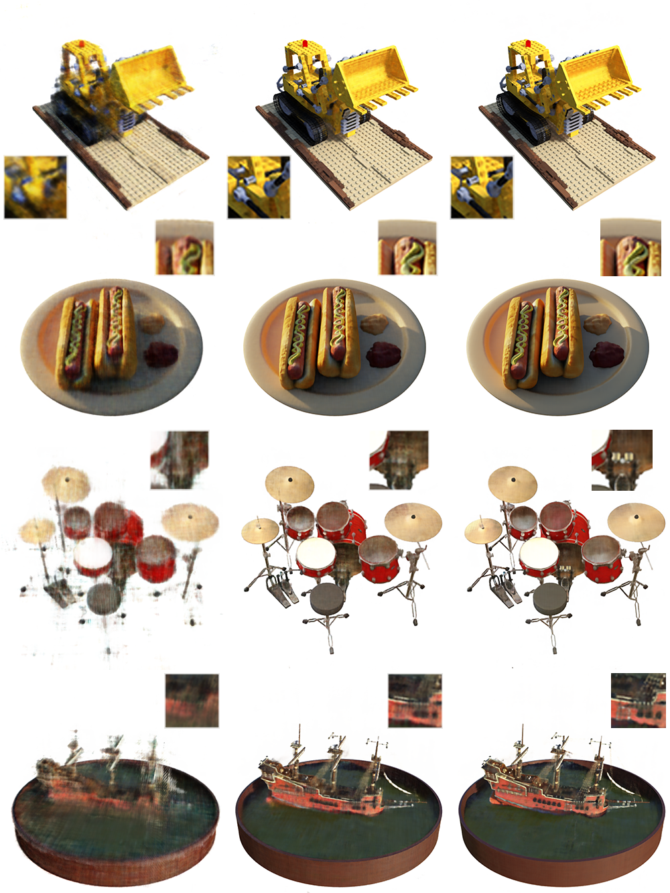

# StreamNeRF
This repository is an official fork of the [MipNeRF](https://github.com/google/mipnerf) repository and includes the implementation of StreamNeRF, a progressive decoding adaptation for NeRF models. This project is part of the [2023 Research Project](https://github.com/TU-Delft-CSE/Research-Project) at [TU Delft](https://github.com/TU-Delft-CSE).

## Abstract
Neural Radiance Fields (NeRF) and their adaptations are known to be computationally intensive during both the training and the evaluating stages. Despite being the end goal, directly rendering a full-resolution representation of the scene is not necessary and not very practical for scenarios like streamed applications. Our goal is to design a streamable adaptation for a model that can produce fast, rough estimates of 3D scenes, by only using a shallow part of the network. The quality is subsequently improved as more parts of the network are available, such that it can be used in online applications where the model needs to be transferred. Separate models can be trained at different resolutions, but this approach results in a large space overhead and also increases the evaluation time. This can be mitigated by reducing the depth of low-resolution models, but redundancy will still be high as each new model needs to re-evaluate the input data, rendering previous calculations obsolete. Our method combines key concepts from previous approaches to create a progressively trained model that is able to produce intermediate outputs of increasing quality while attempting to optimize the trade-off between overhead and quality. Our model is able to produce a recognizable representation of the scene with as little as one hidden layer from the original model. It also allows for division into streamable chunks which can be sent individually and, upon reconstruction, provide intermediate outputs that bring consistent improvement in quality. The newly streamed data uses the residual output from previous computations in order to reduce redundancy. We show that the final quality of our adaptation is within 2% of the original in terms of previously used quantitative metrics.

## Visual results

## Installation
Please see the README file of [MipNeRF](https://github.com/google/mipnerf) for installation instructions. To run the adapted model, use `scripts/train_stream.sh` and `scripts/eval_stream.sh` instead of the equivalent original files.

## Acknowledgements
I would like to thank the authors of [NeRF](http://www.matthewtancik.com/nerf) and [MipNeRF](https://jonbarron.info/mipnerf/), and the developers of [JaxNeRF](https://github.com/google-research/google-research/tree/master/jaxnerf).